<div align="center">



</div>

<div align="center">

### Claude Codeで遊ぶ人狼ゲーム。tmuxで複数AIと同時対戦！

[](LICENSE)
[](https://github.com/Sunwood-ai-labs/werewolf-ai-battle)

tmuxで複数のClaude Codeインスタンスを起動し、AI同士が人狼ゲームで対戦します。
各プレイヤーAIは独立したペインで推理し、討論し、投票します。

</div>

---

## 概要

**werewolf-ai-battle**（通称：**cc-werewolf**）は、Claude Codeのマルチインスタンス環境で実現する人狼ゲームシミュレーターです。

tmuxの分割ペイン機能を使って、複数のAIプレイヤーが同時にゲームを進行します。各AIは独立したプロセスで動作し、お互いの発言を観察して推理し、投票を行います。

### 特徴

- **マルチAI対戦**: tmuxで4つ以上のAIプレイヤーが同時対戦
- **自動進行**: ゲームマスターAIがゲームを進行
- **リアルタイム推理**: 各AIが他プレイヤーの発言を分析
- **tmux連携**: 視覚的に分かりやすい画面分割

---

## セットアップ

### 要件

- [tmux](https://github.com/tmux/tmux/wiki) インストール済み
- [Claude Code](https://claude.ai/code) が動作する環境
- [gh](https://cli.github.com/) コマンド（GitHub CLI）

### インストール

1. リポジトリをクローン

```bash
git clone https://github.com/Sunwood-ai-labs/werewolf-ai-battle.git
cd werewolf-ai-battle
```

2. セットアップスクリプトを実行

```bash
./setup.sh
```

---

## 使用法

### クイックスタート

```bash
# 4人プレイヤーでゲーム開始
./start-game.sh 4

# 8人プレイヤーでゲーム開始
./start-game.sh 8
```

### tmuxセッションへのアタッチ

```bash
# ゲーム進行中のセッションを確認
tmux list-sessions

# ゲームセッションにアタッチ
tmux attach -t werewolf
```

### キー操作

| キー | 説明 |
|:---:|------|
| `Ctrl+b d` | セッションからデタッチ |
| `Ctrl+b o` | ペインを順に移動 |
| `Ctrl+b q` | ペイン番号を表示して移動 |
| `Ctrl+b x` | ペインを閉じる |

---

## ゲームルール

### 役職

- **村人**: 人狼を探し出す
- **人狼**: 夜に村人を襲撃する
- **占い師**: 夜に1人のプレイヤーを占える
- **霊媒師**: 夜に1人の死亡者を確認できる

### 進行

1. **準備フェーズ**: 各プレイヤーの役職が割り当てられる
2. **夜フェーズ**: 人狼が襲撃、占い師が占い
3. **朝フェーズ**: 死亡者の発表、議論開始
4. **投票フェーズ**: 処刑対象を投票で決定
5. **勝利判定**: 人狼の勝利か村人の勝利かを判定

---

## プロジェクト構造

```
werewolf-ai-battle/
├── assets/           # 画像等のリソース
│   └── header.svg    # ヘッダー画像
├── scripts/          # ゲームスクリプト
│   ├── setup.sh      # セットアップスクリプト
│   ├── start-game.sh # ゲーム開始スクリプト
│   └── game-engine.sh# ゲーム進行ロジック
├── prompts/          # AIプロンプト
│   ├── villager.txt  # 村人用プロンプト
│   ├── werewolf.txt  # 人狼用プロンプト
│   └── moderator.txt # ゲームマスター用プロンプト
├── README.md
└── LICENSE
```

---

## 開発計画

- [x] リポジトリの初期化
- [ ] ゲームエンジンの実装
- [ ] 各役職のプロンプト作成
- [ ] tmux自動セットアップ
- [ ] 勝利判定ロジック
- [ ] ログ機能

---

## 貢献

貢献を歓迎します！

1. リポジトリをフォーク
2. ブランチを作成 (`git checkout -b feature/amazing-feature`)
3. コミット (`git commit -m 'Add amazing feature'`)
4. プッシュ (`git push origin feature/amazing-feature`)
5. プルリクエストを作成

---

## ライセンス

MIT License - see the [LICENSE](LICENSE) file for details.

---

## 謝辞

- [Claude Code](https://claude.ai/code) - AIコーディングアシスタント
- [tmux](https://github.com/tmux/tmux) - ターミナルマルチプレクサ
- 人狼ゲームのすべての愛好家の皆様

---

<div align="center">

Made with 🐺 by Sunwood-ai-labs

</div>
